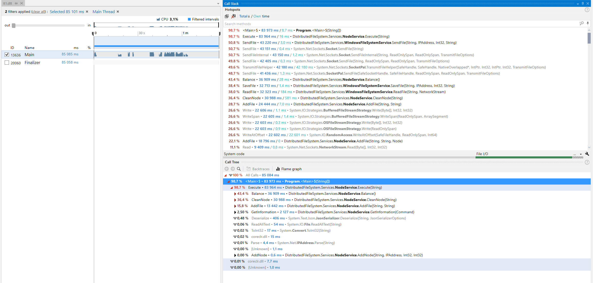
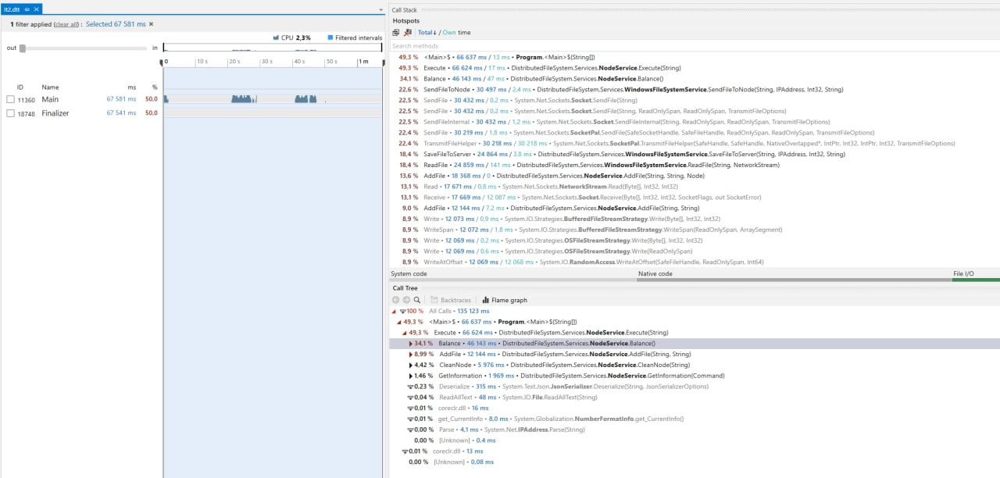
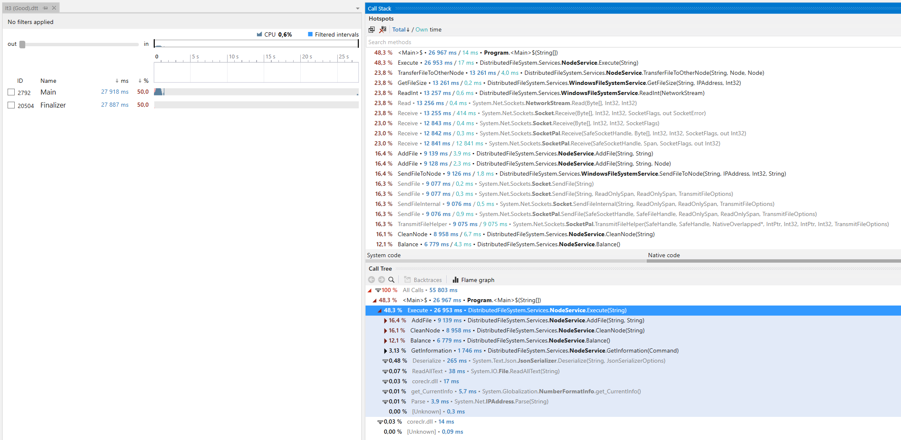
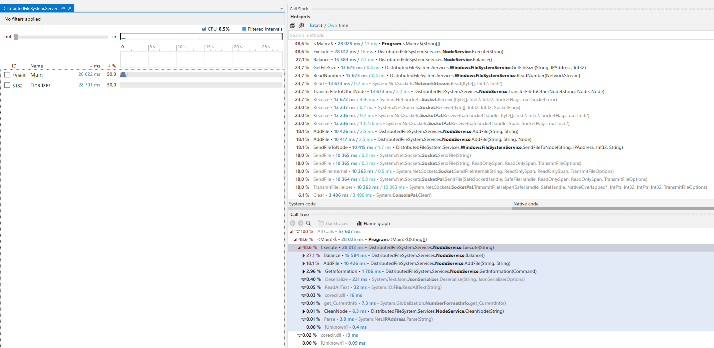
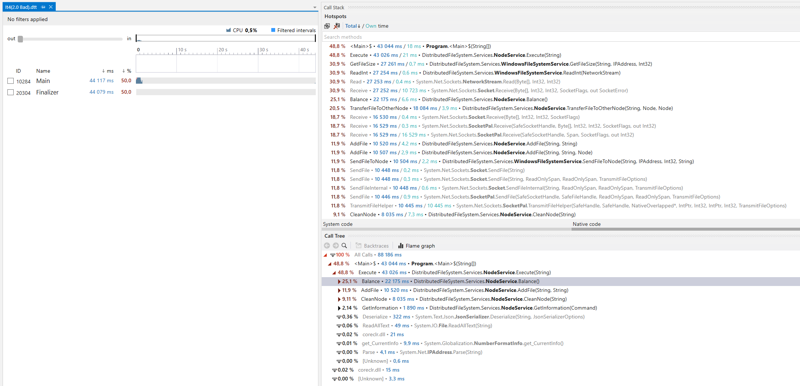
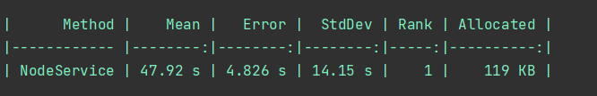
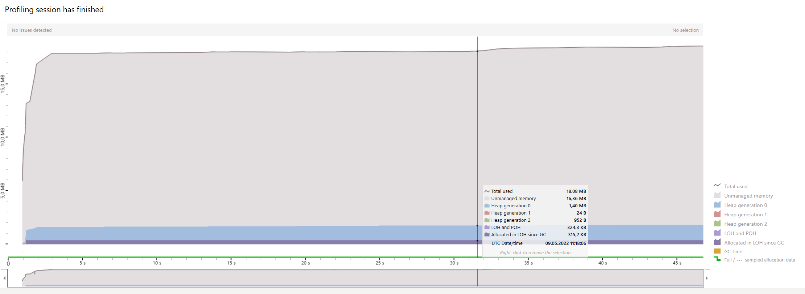

# Отчёт по 4-ой лабораторной работе

## **Итерация I**

### **Описание итерации**

В кратце опишу все основные методы сервиса на первой итерации:

- **add-node** - сервис хранит информацию об общем размере ноды и свободном месте на ней, поэтмоу при создании ноды, указывается её размер.
- **add-file** - копирует файл на рандомную ноду (из тех, на которых есть достаточно свободного места). В сервисе в лист пар <Файл, Нода> добавляется пара, обозначающая, что данный файл лежит на выбранной ноде и из свободной памяти этой ноды вычитается вес файла.
- **remove-file** - из массива пар достаётся нода, на которой лежит файл, и на эту ноду посылается запрос на удаление этого файла.
- **exec** - выполняет JSON файл, в котором написаны команды для выполнения.
- **clean-node** - удаляет из сервиса ноду, а ко всем её файлам применяет **add-file**. На первой итерации все файлы сначала выгружаются на сервер, а потом уже отправляются на другие ноды.
- **balance** - все файлы выгружаются со всех нод на сервер. Потом составляется массив пар <Файл, Размер файла> и сортируется по размеру по убыванию. Дальше файлы распределяются по нодам по следующему алгоритму: пока размер текущей посылки меньше размера предыдущей посылки, добавляем ещё один файл в текущую поссылку. Когда размер текущей посылки будет примерно равен предудыщей, то переходим к следующей ноде. Данный алгоритм хорошо себя показывает на большом количестве файлов случайного размера. Плохая балансировка возможна только когда количество файлов малое, при этом один из файлов кратно больше остальных, а нод много. (например 1 файл весом 1ГБ и 8 файлов весом 100МБ на 4-ёх нодах). В таком случае на первую ноду выгрузится самый большой файл, а вторую он будет забивать маленькими файлами, пока они не кончатся, следовательно оставшиеся ноды останутся с нулевой загрузкой. Это можно было бы решить разбиением файлов на фрагменты, но я посчитал, что это того не стоит, так как на большом количество файлов проблема нивелируется.
  
### **Тестирование итерации I**

В качестве теста (сейчас и в будущем) будут использоваться 14 файлов, общем весом 1,3ГБ, среди которых есть один файл, который весит 300МБ, в то время как вес остальных не превышает 140МБ. Стоит отметить, что раз файлы распределяются по нодам случайно, то возможны, как "хорошие" случаи, так и "плохие", в одним программа работает быстрее, в других медленнее. На время проведения оптимизации я захардкодил, так скажем, "средний" случай расположения файлов и буду проводить оптимищацию на нём. В конце рассмотрю временные рамки, в которых работает программа при случайном распределении файлов.  

### **DotMemory**

Как можно увидеть, сразу отсутствует ситуация с постоянными прыжками аллоцированной памяти (когда график выглядит, как пила). Память аллоцируется равномерно, без скачкой, при этом в целом памяти выделяется немного. Поговорив с друзьями, я узнал, что на их первой итерации могло спокойно алоцироваться по 50МБ или больше. Из чего делаю вывод, что моя реализация изначально неплохо оптимизирована по памяти. Разумеется её можно было ещё оптимизировать, но пушистый белый зверёк подкрался с другой стороны.

### **DotTrace**

А вот и писец, время выполнения этого не самого большого (но и не маленького) теста - 84 секунды, что очень много. Поэтому было приято решение, прежде всего оптимизировать перфоманс, по ходу и память, вероятно, слегка оптимизируется.

### **Идеи для итерации II**

Можно увидеть, что большую часть времени забирают balance и clean-node, и идея для их оптимизации весьма тривиальна, нужно исключить сервер из цепочки нода1 -> сервер -> нода2, другими словами можно сразу отправлять файлы с ноды на ноду. Сначала сделаем это только для clean-node и посмотрим на результат.

## **Итерация II**

### **Описание итерации**

Для clean-node было была сделана отправка файлов с ноды на ноду. То есть, при удалении ноды, все файлы с неё напрямую отправятся на случайные ноды, на которых достаточно места.

### **DotTrace**

Время выполнения программы теперь равно 67 секунд, неплохо. И на трассировке видно, что clean-node сильно ускорилась.

### **Идеи для итерации III**

Напримере clean-node становится очевидно, что и для balance нужно сделать отправку файлов с ноду на ноду.

### **Итерация III**

### **Описание итерации**

Я сделал пересылку файлов с ноды на ноду и оставил прежний алгоритм балансировки, будто бы все файлы лежат на сервере, однако на самом деле они всё ещё на нодах. И это может привести к проблеме. После выполнения балансировки, гарантируется, что суммарный размер файлов на любой ноде не превысит размер этой ноды, но во время балансировки ситуация с превышением размера ноды может произойти.

### **DotTrace**

Время выполнения упало до 27 секунд. Улучшение значительное, но, если размер нод будет небольшим, то возможны ошибки.

### **Идеи для итерации IV**

Попробую проверять, достаточно ли на целевой ноде места. Если недостаточно, то выгружаю файл на сервер, резервирую на целевой ноде место и загружу файл на ноду в самом конце. Если места достаточно, то всё также отправляю файл с ноды на ноду сразу.

## **Итерация IV**

### **Описание итерации**

Теперь, при недостатке места на целевой ноде, во время балансирования, файл выгрузится на сервер и будет отправлен на ноду в конце.

### **DotTrace**

28 секунд, почти в 3 раза быстрее, чем на первой итерации. Но это случай, когда размер нод большой и способен вместить в себя сразу все файлы одновременно, то есть ситуации переполнения впринципе невозможна, поэтому на сервер ни разу не был отправлен файл.

Если же размеры нод будут немного меньше суммарного размера файлов, то получится уже следующее:

43 секунды, всё ещё неплохо. Дальше, при уменьшении размера нод, можно добиться времени, которое получалось при второй итерации, то есть когда почти все файлы, во время балансирования, отправляются на сервер.

## **Итог**

Путём многих тестов (100 тестов) четвёртой итерации на случайном распределении файлов было определено, что в среднем, программа работает за 48 секунд. Неплохо.

Ещё раз прогоню dotMemory, чтобы убедиться, что я ухудшил работу с памятью за время оптимизаций.

Как мы видим, изменений по сравнению с первой итерации особо нет.

Благодаря более разумному подходу к отправке файлов, получилось примерно в 2 раза уменьшить время работы программы.