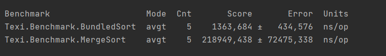

# Шевченко Валерий, M32001
## Лабораторная работа №1 по технологиям программирования

### **1. Функциональная совместимость**
>Изучить механизм интеропа между языками, попробовать у себя вызывать C/C++ (Не C++/CLI) код (суммы чисел достаточно) из Java и C#. В отчёте описать логику работы, сложности и ограничения этих механизмов.

### **С# и C++**
Вызов C++ функций из C# проекта делается довольно просто. Сначала нужно сформировать .dll файл из C++ кода, а потом с помощью dllexport вызвать реализацию функции в C# коде.

### С++ код:
```cpp
extern "C" {
    int sum(int a, int b) {
        return a + b;
    }
}
```
Чтобы сформировать .dll, можно воспользоваться консольными командами или в CLion выбрать тип проекта "Library" типа "Shared", тогда при сборке в папке cmake-build-debug будет лежать .dll файл.

### С# код:
```cs
using System;
using System.Runtime.InteropServices;

namespace CppCsharp
{
    public class Program
    {
        public const string CppDll = @"E:\ITMO prog\CppCsharp\cmake-build-debug\libCppCsharp.dll";

        [DllImport(CppDll, CallingConvention = CallingConvention.Cdecl)]
        public static extern int sum(int a, int b);

        static void Main(string[] args)
        {
            Console.Write(sum(1, 2));
        }
    }
}
```
Тут нужно объявить внешнюю функцию и указать путь до .dll файла. В итоге возмётся реализация функции из кода, написанного на C++.

### **Java и C++**
C Java всё посложней, придётся написать побольше строк кода и директив препроцессора, а также есть шанс, что придётся танцевать с бубном.

### C++ код:
```cpp
#ifndef BUILD_MY_DLL_H
#define BUILD_MY_DLL_H
#include <cstdio>

#ifdef __cplusplus
    extern "C" {
#endif

#ifdef BUILD_MY_DLL
    #define SHARED_LIB __declspec(dllexport)
#else
    #define SHARED_LIB __declspec(dllimport)
#endif

void sum(int left, int right);

#ifdef __cplusplus
    }
#endif

#endif

void sum(int left, int right) {
    printf("%d", left + right);
}
```

Собрать .dll файл можно также в CLion или с помощью командной строки.

### Пример команд из cmd для сборки .dll:
```bat
g++ -c -I%JAVA_HOME%\include -I%JAVA_HOME%\include\win32 sum.cpp -o sum.o
g++ -shared -o sum.dll sum.o -W
```
Где ```%JAVA_HOME%``` - путь до Java на вашем компьютере.

### Java код:
```java
package Package;

public class Java {
    static {
        System.load("E:\\ITMO prog\\untitled3\\sum.dll");
    }

    private native void sum(int left, int right);

    public static void main(String[] args) {
        new Java().sum(1, 2);
    }
}
```
Здесь также указываем путь до .dll, объявляем внешнюю функциюю и вызываем её. К сожалению, это решение, по неизвестным причинам, может как сработать, так и нет. В моём случае, интероп Java и C++ заработал только на одном из двух ноутбуков, а том ноутбуке, где всё-таки работало, работало через раз.

### **2. Функциональные языки в проектах**
> Написать немного кода на Scala и F# с использованием уникальных возможностей языка - Pipe operator, Discriminated Union, Computation expressions и т.д. . Вызвать написанный код из обычных соответствующих ООП языков (Java и С#) и посмотреть во что превращается написанный раннее код после декомпиляции в них.

### **F# и C#**
### F# код:
```fs
open System

let print message =
    printf $"%s{message}\n"
 
"Hello World" |> print
 
type Shape =
   | Rectangle of width : float * length : float
   | Circle of radius : float
   | Prism of width : float * float * height : float
    
let rect = Rectangle(length = 1.3, width = 10.0)
let circ = Circle (1.0)
let prism = Prism(5., 2.0, height = 3.0)
```
В F# я решил применить пару уникальных возможностей этого языка, чтобы посмотреть, во что это потом декомпилируется. Сначала идёт Pipe Operator, а потом Discriminated Union.

### C# код:
```cs
using System;

namespace Csharp
{
    class Program
    {
        static void Main(string[] args)
        {
            global::Program.print("Hello");
            
            global::Program.Shape circle = global::Program.Shape.NewCircle(5.0);
            global::Program.Shape prism = global::Program.Shape.NewPrism(5.0, 1.0, 8.0);
            global::Program.Shape rectangle = global::Program.Shape.NewRectangle(5.0, 10.0);
        }
    }
}
```
Как мы видим, функции и объекты из F# файла можно спокойно вызывать в C# файле. Попробуем декомпилировать F# код, чтобы посмотреть, во что он превращается. Как оказалось, Discriminated Union декомпилируется в огромное количество строк кода, что не позволяет вставить это в отчёт, но в целом можно сделать по нему выводы, что просто создаётся абстрактный класс Shape, от которого уже наследуются фигуры и реализуются. А с Pipe Operator всё понятно, создаётся функция, которая потом вызывается.

### **Scala и Java**
### Scala код:
```scala
package ScalaPackage

import scala.util.chaining._

class Math {
  def multiply2(x: Int): Int = x * 2
  def division2(x: Int): Int = x / 2

  def prevEvenNumber(x: Int): Int = x.pipe(division2).pipe(multiply2)
}
```
В Scala я решил использовать только Pipe, так как он был наиболее понятен незнакомому со Scala человеку.

### Java код:
```java
package JavaPackage;

import ScalaPackage.Math;

public class Main {
    public static void main(String[] args) {
        Math math = new Math();
        System.out.print(math.prevEvenNumber(7));
    }
}
```
В целом, логика тут точно такая же, как и с взаимодействием F# и C#. Конечно я декомпилировал Scala код в Java, чтобы посмотреть во что превратиться Pipe.
### Декомпилированный Scala код в Java:
```java
package ScalaPackage;

import java.lang.invoke.SerializedLambda;
import scala.Function1;
import scala.reflect.ScalaSignature;
import scala.runtime.BoxesRunTime;
import scala.util.ChainingOps$;
import scala.util.package$chaining$;

...
какой-то мусор
...

public class Math {
    public int multiply2(int x) {
        return x * 2;
    }
    
    public int division2(int x) {
        return x / 2;
    }

    public int prevEvenNumber(int x) {
        return BoxesRunTime.unboxToInt(ChainingOps$.MODULE$.pipe$extension(package$chaining$.MODULE$.scalaUtilChainingOps(ChainingOps$.MODULE$.pipe$extension(package$chaining$.MODULE$.scalaUtilChainingOps(BoxesRunTime.boxToInteger(x)), (Function1)this::$anonfun$prevEvenNumber$1)), (Function1)this::$anonfun$prevEvenNumber$2));
    }
}
```
Но декомпилятор просто подключил Scala модуль с Pipe и по сути применил тот же самый Pipe, но уже в Java, так что ничего интересного увидеть не удалось.

### **3. Пакетные менеджеры**
>Написать алгоритм обхода графа (DFS и BFS) на языке Java, собрать в пакет и опубликовать (хоть в Maven, хоть в Gradle, не имеет значения). Использовать в другом проекте на Java/Scala этот пакет. Повторить это с C#/F#. В отчёте написать про алгоритм работы пакетных менеджеров, особенности их работы в C# и Java мирах.

### **C#**
### C# алгоритмы графов:
```cs
using System;
using System.Collections.Generic;

namespace GraphsForTexi
{
    public class Graph
    {
        private int Vertices;
        private List<Int32>[] adj;


        public Graph(int v)
        {
            Vertices = v;
            adj = new List<Int32>[v];

            for (int i = 0; i < v; i++)
            {
                adj[i] = new List<Int32>();
            }
        }

        public void AddEdge(int v, int w)
        {
            adj[v].Add(w);
        }

        public void BFS(int s)
        {
            bool[] visited = new bool[Vertices];

            Queue<int> queue = new Queue<int>();
            visited[s] = true;
            queue.Enqueue(s);

            while (queue.Count != 0)
            {
                s = queue.Dequeue();
                Console.WriteLine("next->" + s);

                foreach (Int32 next in adj[s])
                {
                    if (!visited[next])
                    {
                        visited[next] = true;
                        queue.Enqueue(next);
                    }
                }

            }
        }

        public void DFS(int s)
        {
            bool[] visited = new bool[Vertices];

            Stack<int> stack = new Stack<int>();
            visited[s] = true;
            stack.Push(s);

            while (stack.Count != 0)
            {
                s = stack.Pop();
                Console.WriteLine("next->" + s);
                foreach (int i in adj[s])
                {
                    if (!visited[i])
                    {
                        visited[i] = true;
                        stack.Push(i);
                    }
                }
            }
        }

        public void PrintAdjacecnyMatrix()
        {
            for (int i = 0; i < Vertices; i++)
            {
                Console.Write(i + ":[");
                string s = "";
                foreach (var k in adj[i])
                {
                    s = s + (k + ",");
                }

                s = s.Substring(0, s.Length - 1);
                s = s + "]";
                Console.Write(s);
                Console.WriteLine();
            }
        }
    }
}
```
Процесс добавления своего пакета на Nuget весьма прост. Нужно просто нажать на проект правой кнопкой мыши и собрать проект в .nupkg файл. После чего зарегистрироваться на сайте Nuget.org и загрузить туда свой пакет. Через некоторое время он загрузится и его сможет скачать себе любой (если не выключена видимость пакета в поиске). На примере Rider, скачать свой пакет можно, зайдя во вкладку Nuget (находится внизу экрана) и найдя в поиске свой пакет.

### C# пример использования своего пакета в другом проекте:
```cs
using GraphsForTexi;

namespace TestPackageForTP
{
    public class Program
    {
        static void Main(string[] args)
        {
            Graph graph = new Graph(6);
            
            graph.AddEdge(1, 2);
            graph.AddEdge(0, 2);
            graph.AddEdge(2, 3);
            graph.AddEdge(3, 4);
            graph.AddEdge(1, 4);
            graph.AddEdge(1, 5);
            
            graph.DFS(1);
        }
    }
}
```

### **Java**
В случае в Java я буду пользоваться пакетным менеджером Maven в Intellij IDEA.

### Java алгоритмы графов:
```java
package graph;

import java.util.*;

public class Graph
{
    private int V;
    private LinkedList<Integer> adj[];

    public Graph(int v)
    {
        V = v;
        adj = new LinkedList[v];
        for (int i=0; i<v; ++i)
            adj[i] = new LinkedList();
    }

    public void addEdge(int v,int w)
    {
        adj[v].add(w);
    }

    public void BFS(int s)
    {
        boolean visited[] = new boolean[V];

        LinkedList<Integer> queue = new LinkedList<Integer>();

        visited[s]=true;
        queue.add(s);

        while (queue.size() != 0)
        {
            s = queue.poll();
            System.out.print(s+" ");

            Iterator<Integer> i = adj[s].listIterator();
            while (i.hasNext())
            {
                int n = i.next();
                if (!visited[n])
                {
                    visited[n] = true;
                    queue.add(n);
                }
            }
        }
    }
}
```
Тут я покажу локальный способ использования пакетов, то есть не загружая их в общий репозиторий пакетов. Для начала нужно создать Maven проект, разумеется написать код, из которого нужно сделать пакет, а потом зайти в меню Maven в правой части экрана. Там нужно выбрать Maven Goal (кнопка с буквой m) и там можно выбрать все Maven функции, нам нужна Maven packege. После этого в папке Target появится .jar файл с нашим кодом. Дальше, чтобы уже воспользоваться своим пакетом, нужно создать новый проект, перейти в Project Structure и подключить пакет в папке Libraries.

### Java пример использования своего пакета в другом проекте:
```java
package main.java.graph;

import graph.Graph;

public class Program {
    public static void main(String[] args) {
        Graph g = new Graph(5);

        g.addEdge(0, 1);
        g.addEdge(1, 2);
        g.addEdge(0, 3);
        g.addEdge(3, 2);
        g.addEdge(4, 1);

        g.BFS(0);
    }
}
```
По сути, использование аналогично тому, как используется пакет в C#.

### **4. Анализ производительности C# и Java на примере сортировок**
>Изучить инструменты для оценки производительности в C# и Java. Написать несколько алгоритмов сортировок (и взять стандартную) и запустить бенчмарки (в бенчмарках помимо времени выполнения проверить аллокации памяти). В отчёт написать про инструменты для бенчмаркинга, их особености, анализ результатов проверок.
### **C#**
В C# есть удобные инструменты для бэнчмарка, которые можно загрузить через Nuget. Пакет называется BenchmarkDotNet.
### C# алгоритмы сортировок:
```cs
using System.Collections.Generic;

namespace Benchmark
{
    public class SortAlgorithms
    {
        public void BundledSort(List<int> list)
        {
            list.Sort();
        }
        
        public void MergeSort(List<int> numbers, int left, int right)    
        {    
            int mid;    
            if (right > left)    
            {    
                mid = (right + left) / 2;    
                MergeSort(numbers, left, mid);    
                MergeSort(numbers, mid + 1, right);    
                Merge(numbers, left, mid + 1, right);    
            }    
        } 
        
        private void Merge(List<int> numbers, int left, int mid, int right)    
        {    
            int[] temp = new int[numbers.Count];    
            int i, eol, num, pos;    
            eol = mid - 1;    
            pos = left;   
            num = right - left + 1;     
  
            while (left <= eol && mid <= right)    
            {    
                if (numbers[left] <= numbers[mid])    
                    temp[pos++] = numbers[left++];    
                else    
                    temp[pos++] = numbers[mid++];    
            }    
            while (left <= eol)    
                temp[pos++] = numbers[left++];    
            while (mid <= right)    
                temp[pos++] = numbers[mid++];   
            for (i = 0; i < num; i++)    
            {    
                numbers[right] = temp[right];    
                right--;    
            }    
        }
    }
}
```
### C# Benchmark:
```cs
using System;
using System.Collections.Generic;
using BenchmarkDotNet.Attributes;
using BenchmarkDotNet.Order;

namespace Benchmark
{
    [MemoryDiagnoser]
    [Orderer(SummaryOrderPolicy.FastestToSlowest)]
    [RankColumn]
    public class SortingBenchmarks
    {
        private readonly SortAlgorithms _sortAlgorithms = new();
        private const int Length = 5000;
        private List<int> List { get; set; } = new(Length);

        [GlobalSetup]
        public void Setup()
        {
            List = new List<int>(Length);
        }

        [IterationSetup]
        public void FillArray()
        {
            Random rand = new();
            for (var i = 0; i < List.Count; i++)
            {
                List[i] = rand.Next();
            }
        }
        
        [Benchmark]
        public void BundledSort()
        {
            _sortAlgorithms.BundledSort(List);
        }
        
        [Benchmark]
        public void MergeSort()
        {
            _sortAlgorithms.MergeSort(List, 0, List.Count - 1);
        }
    }
}
```
Библиотека с бенчмарками интуитивно понятна и легко используема. Я использую лист из 5000 случайных элементов и провожу два теста с разными сортировками.
### Запуск Benchmark из Main:
```cs
using BenchmarkDotNet.Running;

namespace Benchmark
{
    public class Program
    {
        public static void Main()
        {
            BenchmarkRunner.Run<SortingBenchmarks>();
        }
    }
}
```
### Полученные результаты:


Тут я сравниваю встроенную в C# сортировку и собственную MergeSort, видно что Merge сорт сработала быстрее. Скорее всего это вызвано тем, что встроенная сортировка затратила время на различные проверки и могла использоваться QuickSort, которая могла в данном случае оказаться медленнее. Алоциоруют обе сортировки одинаковое количество памяти.

### **Java**
Инструментарий для анализа также есть и на Java, но его возможности намного более скормные, а точность оставляет желать лучшего.
### Java алгоритмы сортировок:
```java
package Texi;

import java.util.Arrays;

public class SortsAlgorithms {
    public void BundledSort(int[] arr) {
        Arrays.sort(arr);
    }

    public void MergeSort(int[] arr, int n) {
        if (n < 2) {
            return;
        }
        int mid = n / 2;
        int[] l = new int[mid];
        int[] r = new int[n - mid];

        for (int i = 0; i < mid; i++) {
            l[i] = arr[i];
        }
        for (int i = mid; i < n; i++) {
            r[i - mid] = arr[i];
        }
        MergeSort(l, mid);
        MergeSort(r, n - mid);

        Merge(arr, l, r, mid, n - mid);
    }

    private void Merge(int[] arr, int[] l, int[] r, int left, int right) {

        int i = 0, j = 0, k = 0;
        while (i < left && j < right) {
            if (l[i] <= r[j]) {
                arr[k++] = l[i++];
            }
            else {
                arr[k++] = r[j++];
            }
        }
        while (i < left) {
            arr[k++] = l[i++];
        }
        while (j < right) {
            arr[k++] = r[j++];
        }
    }
}
```
### Java Benchmark:
```java
package Texi;

import org.openjdk.jmh.annotations.*;

import java.util.concurrent.TimeUnit;

public class Benchmark {
    public static void main(String[] args) throws Exception {
        org.openjdk.jmh.Main.main(args);
    }

    @org.openjdk.jmh.annotations.Benchmark
    @Fork(value = 1, warmups = 1)
    @Warmup(iterations = 2)
    @OutputTimeUnit(TimeUnit.NANOSECONDS)
    @BenchmarkMode(Mode.AverageTime)
    public void BundledSort() {
        int[] arr = new int[5000];

        for (int i = 0; i < 5000; i++) {
            arr[i] = (int) (Math.random() * 10000);
        }

        SortsAlgorithms sortsAlgorithms = new SortsAlgorithms();

        sortsAlgorithms.BundledSort(arr);
    }

    @org.openjdk.jmh.annotations.Benchmark
    @Fork(value = 1, warmups = 1)
    @Warmup(iterations = 2)
    @OutputTimeUnit(TimeUnit.NANOSECONDS)
    @BenchmarkMode(Mode.AverageTime)
    public void MergeSort() {
        int[] arr = new int[5000];

        for (int i = 0; i < 5000; i++) {
            arr[i] = (int) (Math.random() * 10000);
        }

        SortsAlgorithms sortsAlgorithms = new SortsAlgorithms();

        sortsAlgorithms.MergeSort(arr, 5000);
    }
}
```
Тут я также использую массив длинной в 5000 элементов и проверяю встроенную в Java сортировку и собственную MergeSort.
### Полученные результаты:


Заметим огромную разницу по времени встроенной сортировки в Java со встроенной сортировкой в C#. Это вызвано тем, что в C# я смог разделить время генерации случайного массива от сортировок и замерять только сортировку, а в Java я не нашёл, как это сделать, поэтому замерял время сортировки вместе с генерацией, которая занимает много времени. Среднее время собственной сортировки больше, чем у встроенной, однако оно имеет большую погрешность, поэтому выделать какие-то выводу, я не стану. Также не получилось замерить алокаию в Java.

### **5. Анализ Backups из прошлого семестра, с помощью dotMemory**
>Используя инструменты dotTrace, dotMemory, всё-что-угодно-хоть-windbg, проанализировать работу написанного кода для бекапов. Необходимо написать сценарий, когда в цикле будет выполняться много запусков, будут создаваться и удаляться точки. Проверить два сценария: с реальной работой с файловой системой и без неё. В отчёте неоходимо проанализировать полученные результаты, сделать вывод о написанном коде. Опционально: предложить варианты по модернизации или написать альтернативную имплементацию.

Я сделал по 3 замера с файловой системой и без неё. 

- 1-ый замер - без создания Restore Point.

- 2-ой замер - создание двух Restore Point и удаление одной Restore Point.

- 3-ий замер - цикл из 5000 повторений, в каждом цикле создаётся две Restore Point и удаляется одна Restore Point.

### **Без файловой системы**
### Без Restore Point:


Никаких объектов не создано, поэтому на куче памяти не выделено.

### С одной итерацией:


Видно, что выделилась память на две Restore Point. Память удалённой Restore Point не освободилась, так как GC ещё не чистил памяить.

### С циклом из 5000 повторений


Видно, что потихоньку выделяется память на новые Restore Point, когда GC почистит память, то освободится память, затраченная на лишние Restore Point, а также на вспомогательные объекты, которые во время работы кода создавались. То, что не удалилось GC, помещается в следующее поколение кучи.

### **С Файловой системой**
### Без Restore Point:


Никаких объектов не создано, поэтому на куче памяти не выделено.

### С одной итерацией:


Ситуация похожа на случай с одной итерацией, но без файловой системы, однако памяти выделено чуть больше и память выделилась на два Restore Point. Память удалённой Restore Point удалится, когда до неё доберётся GC.

### С циклом из 5000 повторений:


За счёт того, что памяти выделяется больше, а также ещё память тратится на файловые объекты, то GC работает чаще и чаще освобождает уже не нужные объекты, их намного больше, чем в случае без файловой системы, так как при работе с файловой системы используется много дополнительных объектов. То, что не удалилось GC, помещается в следующее поколение кучи.

Думаю, что можно сильно сократить количество создаваемых, во время работы кода, объектов. А также не пересоздавать сервис, при переходе к следуюещй итерации. 
